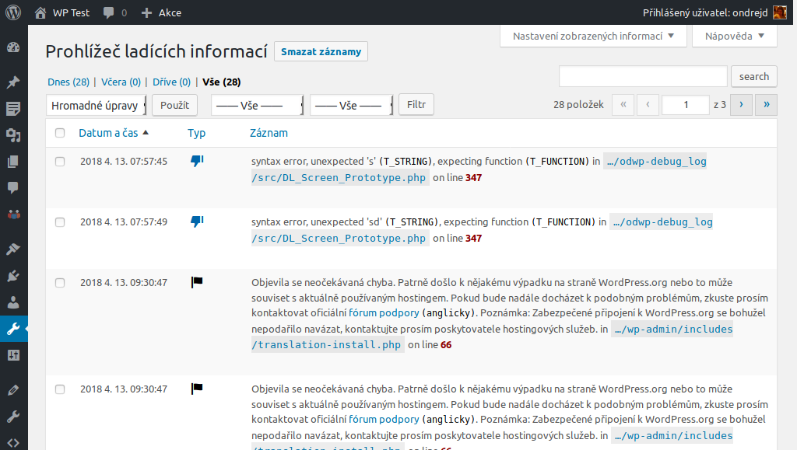
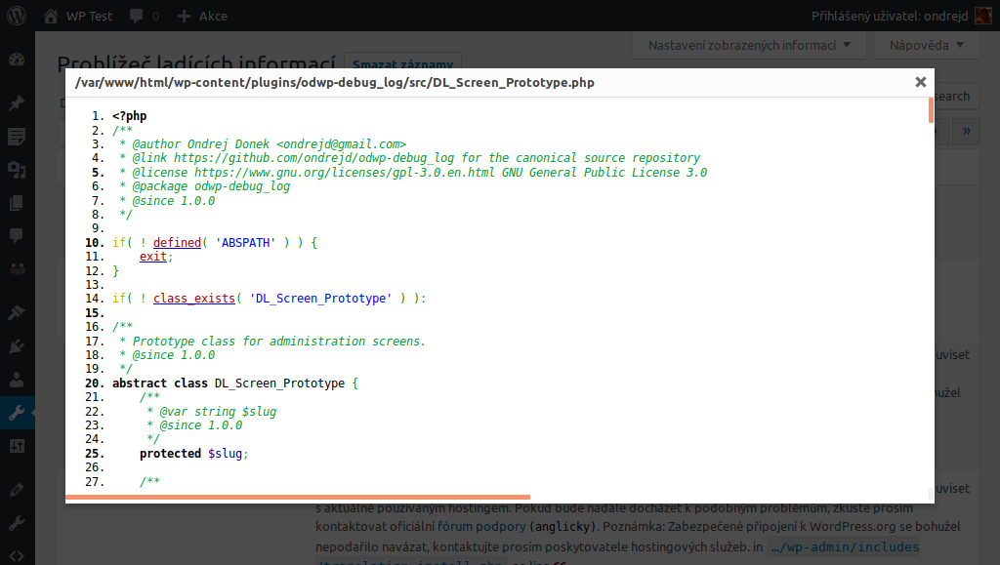

# Prohlížeč ladících informací

_For English version see [README.md][1]._

Malý [WordPress][1] plugin pro vývojáře, kteří chtějí pohodlnější přístup k jejich souboru `debug.log`.

## Dárcovství

Pokud se vám tento plugin líbí a chcete podpořit jeho vývoj, můžete zvážit, zda vývojáři neposlat dar pomocí služby

[][3]

## Hlavní vlastnosti

* povolit/zakázat _WP_ ladící mód přímo z administrace
* widget pro nástěnku administrace se zmenšeným výpisem vašeho `debug.log` souboru
* nová administrátorská stránka (__Administrace__ > __Nástroje__ > __Ladící informace__), kde jsou v tabulce zobrazeny záznamy z vašeho `debug.log` souboru
* soubory se zdrojovými kódy, na které se v záznamech odkazuje, mohou být snadno zobrazeny ve vestavěném prohlížeči (zvýrazňování zdrojových kódů zajišťuje [GeSHi][4])
* anglický a český překlad

## Snímky obrazovky

Níže je několik obrázků:

### Hlavní stránka

#### Okno se zdrojovým kódem

[1]: README.md
[2]: https://wordpress.org/
[3]: https://www.paypal.me/ondrejd
[4]: http://qbnz.com/highlighter/