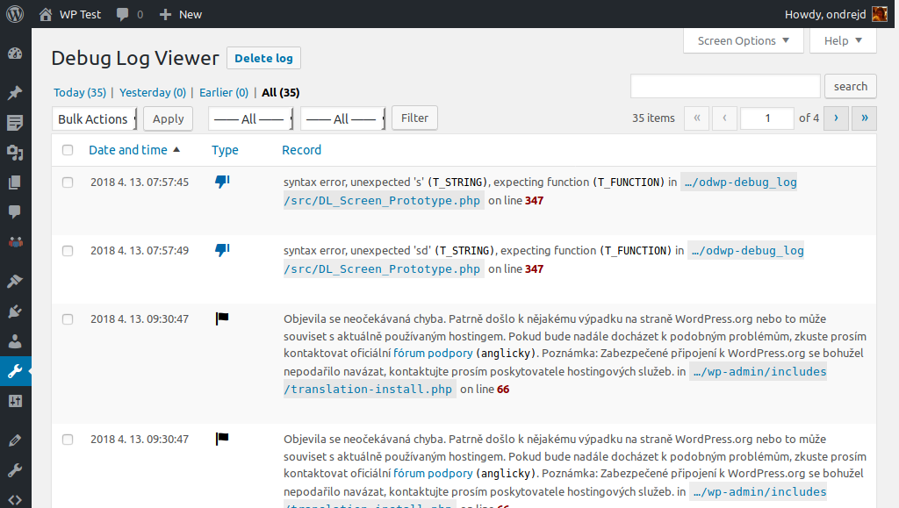
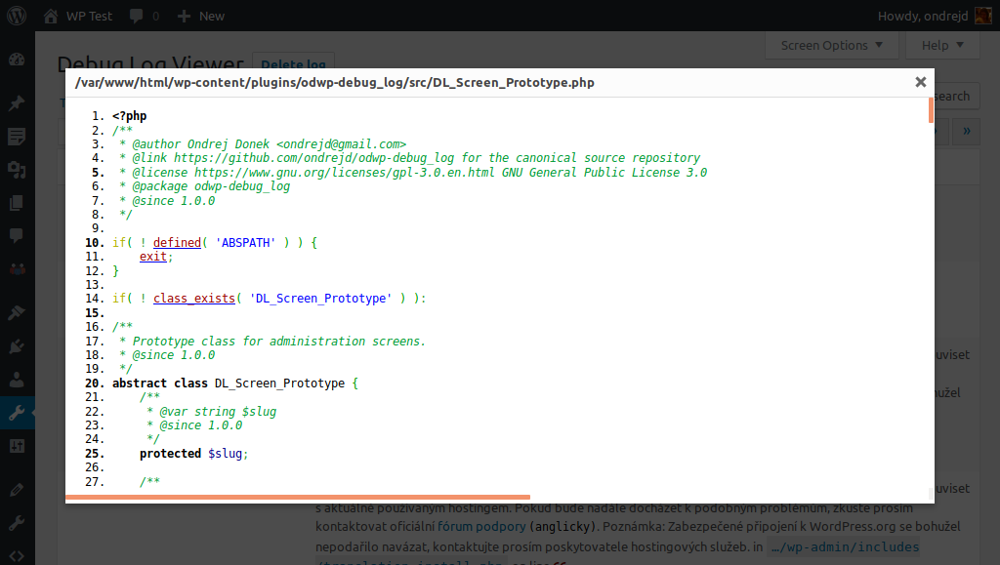

# Debug Log Viewer

_Českou verzi najdete zde [README.cs.md][1]._

Small [WordPress][2] plugin aimed for developers that allows better work with their `debug.log` file.

## Donations

If your like this plugin and you want to be maintained and improved more frequently consider donation using service

[][3]

## Main features

* enabling/disabling _WP_ debug mode directly from _WP_ administration
* widget for _WP_ admin dashboard that displays contents of the `debug.log` file
* _WP_ admin page (__Administration__ > __Tools__ > __Log Viewer__) that displays content of the `debug.log` file
* source files referenced in log can be easily viewed by built-in viewer (for source code highlightning is used [GeSHi][4])
* stack trace (if present) is displayed as collapsable pane
* Czech and English locales

## Screenshots

Here are some screenshots:

### Main page

#### Popup with source codes

[1]: README.cs.md
[2]: https://wordpress.org/
[3]: https://www.paypal.me/ondrejd
[4]: http://qbnz.com/highlighter/
