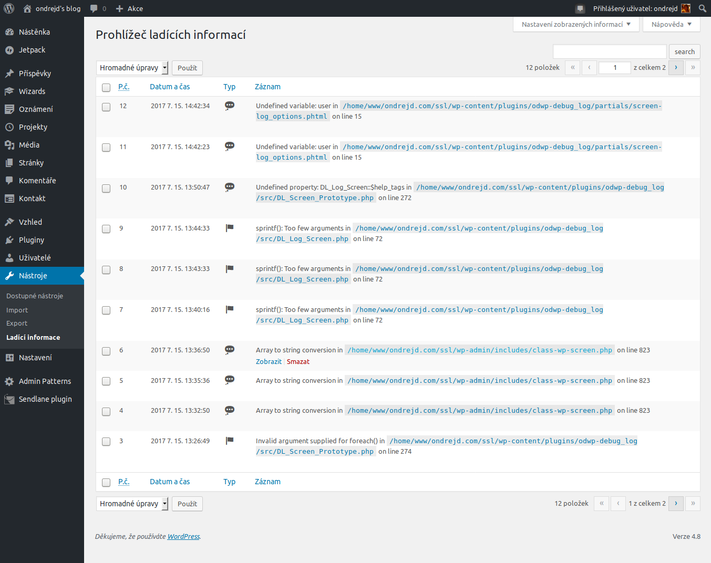
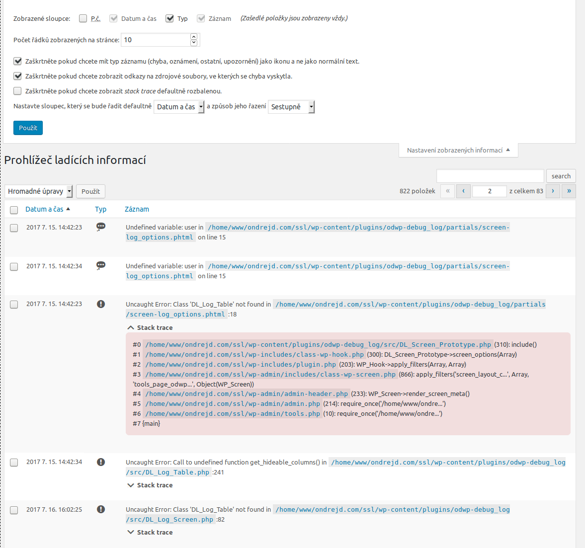
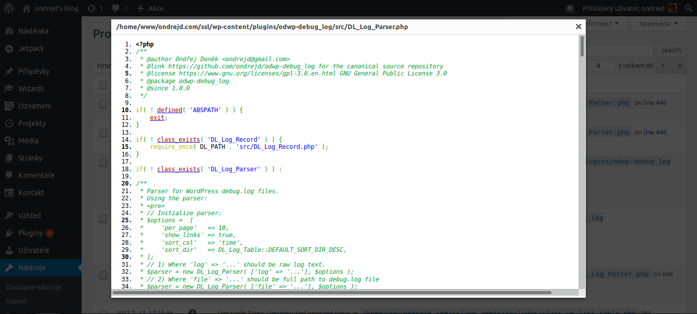

# Debug Log Viewer

Small [WordPress][1] plugin especially for developers that allows better work with `debug.log` file.

## Features

* enabling/disabling _WP_ debug mode directly from _WP_ administration
* widget for _WP_ admin dashboard that displays contents of the `debug.log` file
* _WP_ admin page (__Administration__ > __Tools__ > __Log Viewer__) that displays content of the `debug.log` file
* rich table list for displaying log records implements all what _WP_ offers - sorting, filtering, pagination, screen options etc.
* source files referenced in log can be easily viewed by built-in viewer (for source code highlightning is used [GeSHi][2])
* stack trace (if present) is displayed as collapsable pane
* Czech ~~and English~~ locales

## TODO

* group log messages (if there are same messages below themself).
* __when opening dialog with file sources the editor should scroll to the correct line__
* finish English locales
* publish on official [WP plugins site](3)

## Screenshots

Here are some screenshots:

### Enabling/disabling debug mode

__TODO__ ~~~~

### Dashboard widget

__TODO__ ~~~~

### Log page

#### Screen options for the log page

~~~~

#### Shown popup with corresponding source file

For source code highlightning is used [GeSHi][2].

~~~~

[1]: https://wordpress.org/
[2]: http://qbnz.com/highlighter/
[3]: https://wordpress.org/plugins/
